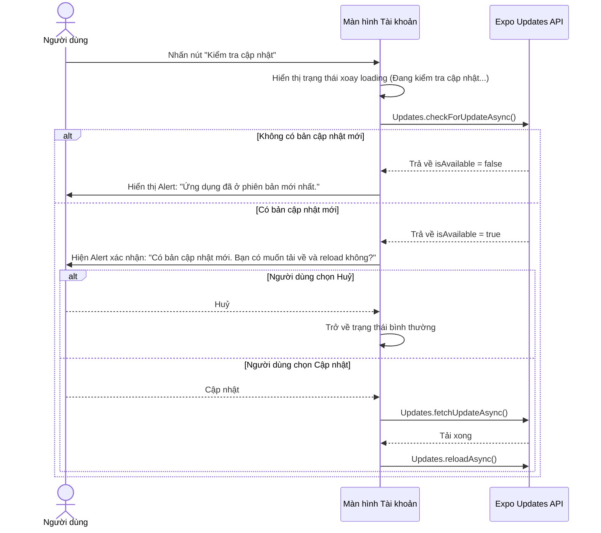

# Kế hoạch chuyển đổi cơ chế OTA Update từ tự động sang thủ công

Mục tiêu là dừng hoàn toàn việc tự động kiểm tra và reload ứng dụng ở `src/app/_layout.tsx` (gây gián đoạn trải nghiệm người dùng). Thay vào đó, chúng ta sẽ thêm tính năng kiểm tra và tải bản cập nhật thủ công ngay trong màn hình **Tài khoản** (`src/app/account.tsx`).

## Quy trình hoạt động mới

## Đề xuất thay đổi

### 1. Cấu hình cốt lõi

#### [MODIFY] [_layout.tsx](file:///d:/django_apps/rest/fontendapp/src/app/_layout.tsx)
- Xoá bỏ hoàn toàn hàm `check_and_apply_update()` trong hook `useEffect` khi ứng dụng khởi động hoặc chuyển trạng thái active (foreground).
- Loại bỏ các import không còn sử dụng (`Updates`, `useEffect` nếu không cần thiết).

### 2. Màn hình Tài khoản

#### [MODIFY] [account.tsx](file:///d:/django_apps/rest/fontendapp/src/app/account.tsx)
- Thêm state `checking_update` kiểu boolean để quản lý trạng thái đang kiểm tra cập nhật.
- Thêm hàm `handle_check_update` xử lý tiến trình kiểm tra bản cập nhật:
  - Nếu là môi trường DEV (`__DEV__`), thông báo ngay và dừng lại.
  - Sử dụng `Updates.checkForUpdateAsync()` để kiểm tra bản cập nhật OTA.
  - Nếu không có cập nhật mới, hiện thông báo "Ứng dụng đã ở phiên bản mới nhất."
  - Nếu có bản cập nhật mới, hiển thị hộp thoại `Alert.alert` để xác nhận từ người dùng. Khi người dùng đồng ý cập nhật thì gọi `Updates.fetchUpdateAsync()` và `Updates.reloadAsync()`.
- Chèn dòng menu **Kiểm tra cập nhật** vào danh sách menu trong `ScrollView`, nằm phía trên mục **Đăng xuất**.
- Đồng bộ UI/UX dòng menu:
  - Khi chưa bấm: Hiện icon đám mây tải xuống `cloud-download-outline` màu xanh lá và chevron bên phải.
  - Khi đang bấm: Hiện `ActivityIndicator` xoay tròn màu xanh, đổi chữ thành `"Đang kiểm tra cập nhật..."` và tắt tương tác.

---

## Kế hoạch xác minh (Verification Plan)

### Kiểm tra thủ công
1. Chạy app ở chế độ DEV, vào trang Tài khoản -> Bấm nút **Kiểm tra cập nhật**. Hệ thống cần hiển thị cảnh báo đang ở dev mode và không tiếp tục kiểm tra OTA.
2. Kiểm tra xem app khi khởi động hoặc chuyển từ background lên foreground còn tự động reload nữa hay không.
3. Khi triển khai bản build Preview (sau này): Bấm nút để kiểm tra phản hồi từ Expo Updates server.
