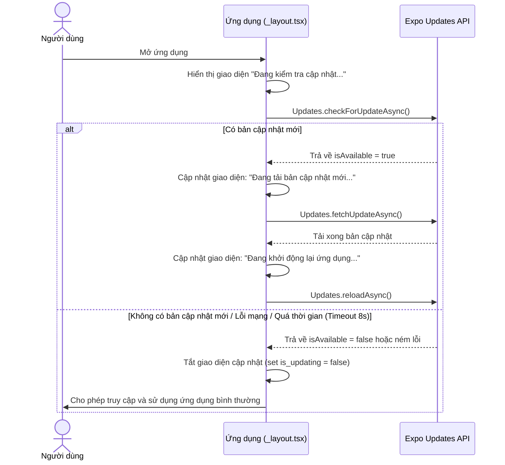

# Kế hoạch cập nhật OTA khi khởi động ứng dụng (Force Update on Startup)

Mục tiêu là tự động kiểm tra và áp dụng bản cập nhật OTA ngay khi khởi động ứng dụng. Trong quá trình kiểm tra và tải bản cập nhật, một màn hình chờ (Splash/Update Screen) đẹp mắt sẽ được hiển thị để chặn người dùng thao tác. Khi hoàn tất cập nhật (hoặc nếu không có cập nhật/lỗi mạng), người dùng sẽ được chuyển vào ứng dụng để sử dụng bình thường.

---

## Quy trình hoạt động mới



---

## Đề xuất thay đổi

### 1. Cấu hình và Giao diện khởi động

#### [MODIFY] [_layout.tsx](file:///d:/django_apps/rest/fontendapp/src/app/_layout.tsx)
- Thêm các state quản lý tiến trình OTA ở mức ứng dụng (Root):
  - `is_updating` (boolean, mặc định là `true` trong môi trường Production để hiển thị màn hình chờ).
  - `update_status` (string, lưu trữ thông điệp hiện tại như `"Đang kiểm tra bản cập nhật..."`, `"Đang tải bản cập nhật mới..."`).
- Thiết lập một hàm chạy bất đồng bộ `check_and_apply_update_startup()` trong `useEffect` khi mount:
  - Nếu là môi trường phát triển (`__DEV__`), đặt `is_updating` thành `false` ngay lập tức để không ảnh hưởng việc code.
  - Sử dụng cơ chế `Promise.race` kết hợp giữa việc kiểm tra cập nhật và một bộ đếm thời gian (Timeout 8 giây). Nếu quá 8 giây mà chưa phản hồi (do mạng yếu hoặc lỗi server Expo), hệ thống tự động bỏ qua và cho phép vào ứng dụng (`is_updating = false`).
  - Thực hiện tuần tự: `checkForUpdateAsync()` -> Nếu có bản cập nhật, chạy tiếp `fetchUpdateAsync()` -> `reloadAsync()`.
  - Nếu không có cập nhật hoặc xảy ra lỗi (catch block), đặt `is_updating` thành `false` để người dùng tiếp tục sử dụng phiên bản hiện tại.
- Xây dựng giao diện Splash Update đẹp mắt:
  - Giao diện full-screen đè lên toàn bộ ứng dụng khi `is_updating === true`.
  - Sử dụng nền màu tối sang trọng (Dark theme / Gradient) kết hợp `ActivityIndicator` xoay tròn, cùng thông tin trạng thái hiển thị rõ ràng ở giữa màn hình.

### 2. Màn hình Tài khoản (Tùy chọn)

#### [MODIFY] [account.tsx](file:///d:/django_apps/rest/fontendapp/src/app/account.tsx)
- Mặc dù đã có cập nhật tự động khi khởi động, chúng ta vẫn có thể giữ lại hoặc thêm nút **Kiểm tra cập nhật** thủ công trong mục cài đặt tài khoản để người dùng có thể check update chủ động mà không cần tắt app đi bật lại.
- Logic kiểm tra thủ công tương tự như đã thiết kế ở kế hoạch trước nhưng sẽ là một tính năng bổ trợ.

---

## Chi tiết Thiết kế Giao diện Update Screen (Dự kiến)

```tsx
if (is_updating) {
  return (
    <View style={styles.update_container}>
      <ActivityIndicator size="large" color="#10B981" />
      <Text style={styles.update_title}>HỆ THỐNG CẬP NHẬT</Text>
      <Text style={styles.update_status}>{update_status}</Text>
    </View>
  );
}
```

*Thiết kế sử dụng màu chủ đạo xanh ngọc (`#10B981`) kết hợp với nền tối (`#0F172A`) để tạo cảm giác hiện đại, cao cấp.*

---

## Kế hoạch xác minh (Verification Plan)

### Kiểm tra tự động & thủ công
1. **Môi trường phát triển (DEV)**:
   - Mở app, hệ thống nhận diện `__DEV__` và bỏ qua màn hình kiểm tra cập nhật ngay lập tức. User truy cập thẳng vào trang login hoặc tab bình thường.
2. **Môi trường Production (Giả lập bằng cách tắt __DEV__)**:
   - Tạm thời comment điều kiện `__DEV__` để kiểm tra UI/UX của màn hình cập nhật.
   - Thử nghiệm tắt mạng (Offline) xem app có tự động vượt qua màn hình cập nhật sau khi lỗi/timeout để vào app dùng offline bình thường không.
3. **Môi trường Production thực tế (Build Preview/Staging)**:
   - Cài đặt app bản Preview.
   - Chạy lệnh OTA Update (`eas update`).
   - Mở app lại để kiểm tra xem màn hình cập nhật có hiển thị, tiến hành tải bản cập nhật và tự động reload ứng dụng thành công hay không.
