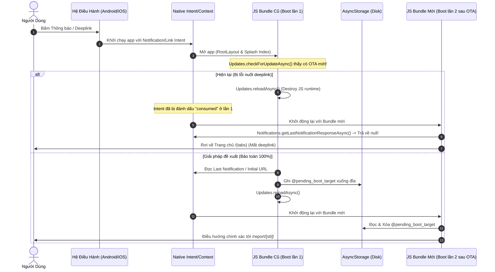

# Kế Hoạch Giải Pháp: Chống Nuốt Deeplink & Notification Khi Khởi Động (Killed State) Có Cập Nhật OTA

Tài liệu này đề xuất giải pháp kỹ thuật triệt để khắc phục lỗi **mất Deep link / Push Notification Intent** khi ứng dụng khởi động từ trạng thái Killed State và gặp bản cập nhật OTA (`Updates.reloadAsync()`).

---

## 1. Bản Chất Vấn Đề (Root Cause Analysis)

### Nguyên nhân kỹ thuật
1. Khi app ở trạng thái **KILLED** và người dùng mở app qua **Push Notification** hoặc **Deep Link**:
   - Native Context truyền Intent ban đầu vào JS Runtime.
2. `RootLayout` (`_layout.tsx`) phát hiện có bản cập nhật OTA $\rightarrow$ thực hiện `Updates.fetchUpdateAsync()` và gọi `Updates.reloadAsync()`.
3. Khi `reloadAsync()` thực thi, JS Runtime bị giải phóng và tải lại từ bundle mới.
4. Ở lần khởi động thứ 2 (sau reload), hàm `Notifications.getLastNotificationResponseAsync()` và `Linking.getInitialURL()` ở tầng Native có thể trả về `null` do Intent đã bị tiêu thụ ở lần boot đầu tiên.
5. `index.tsx` không còn dữ liệu `report_stt` $\rightarrow$ chuyển hướng mặc định về `/(tabs)`, gây mất ngữ cảnh deeplink của người dùng.

---

## 2. Giải Pháp Đề Xuất (3 Lớp Bảo Toàn Toàn Diện)

### Lớp 1: Quản lý Trạng Thái Khởi Động Pending Target (`storage/notification.ts`)
Tạo các helper functions chuyên biệt để lưu và thu hồi an toàn mục tiêu điều hướng:
- `save_pending_boot_target(target: PendingBootTarget)`: Lưu thông tin điều hướng (`report_stt`, `route`, `params`, `type`) vào `AsyncStorage`.
- `get_and_clear_pending_boot_target()`: Lấy dữ liệu và xóa ngay lập tức khỏi storage (Atomic Consume) để không kích hoạt lại ở các lần mở app sau.

### Lớp 2: Đánh Chặn & Lưu Trữ Trước Khi Reload OTA (`app/_layout.tsx`)
Trước khi gọi `Updates.reloadAsync()`, chủ động trích xuất và lưu giữ Intent:
- Kiểm tra `Notifications.getLastNotificationResponseAsync()`.
- Kiểm tra `Linking.getInitialURL()`.
- Nếu có `report_stt` hoặc link điều hướng $\rightarrow$ gọi `save_pending_boot_target(...)` rồi mới gọi `Updates.reloadAsync()`.

### Lớp 3: Phục Hồi Điều Hướng Chính Xác Tại Splash Router (`app/index.tsx`)
Tại màn hình Splash Gatekeeper:
- Đọc song song `stored_user`, `cached_reports`, `Notifications.getLastNotificationResponseAsync()`, và `get_and_clear_pending_boot_target()`.
- Nếu có `pending_target` từ lần boot trước (vừa reload OTA xong) $\rightarrow$ ưu tiên sử dụng để định tuyến thẳng vào đúng báo cáo (`/report/[stt]` hoặc `/report/native/[stt]`).
- Người dùng nhận được mã code mới nhất của OTA và đi thẳng vào đúng nội dung thông báo.

---

## 3. Chi Tiết Các File Sẽ Thay Đổi

### [MODIFY] [notification.ts](file:///d:/django_apps/rest/fontendapp/src/storage/notification.ts)
- Bổ sung interface `PendingBootTarget` (chứa `type`, `report_stt`, `url`).
- Thêm hàm `save_pending_boot_target(target: PendingBootTarget): Promise<void>`.
- Thêm hàm `get_and_clear_pending_boot_target(): Promise<PendingBootTarget | null>`.

### [MODIFY] [_layout.tsx](file:///d:/django_apps/rest/fontendapp/src/app/_layout.tsx)
- Import `* as Linking from 'expo-linking'` và `save_pending_boot_target`.
- Trong `check_and_apply_update`: trước khi gọi `await Updates.reloadAsync()`, kiểm tra và lưu pending notification response / deep link URL.

### [MODIFY] [index.tsx](file:///d:/django_apps/rest/fontendapp/src/app/index.tsx)
- Import `get_and_clear_pending_boot_target` và `* as Linking from 'expo-linking'`.
- Bổ sung đọc `get_and_clear_pending_boot_target()` song song trong `Promise.all`.
- Xử lý điều hướng thông minh: ưu tiên `pending_target` $\rightarrow$ `last_response` $\rightarrow$ `deep_link_url` $\rightarrow$ `/(tabs)`.

---

## 4. Kế Hoạch Kiểm Tra & Xác Minh (Verification Plan)

### Kiểm Tra Mã Nguồn & Type Safety
- Chạy `npx tsc --noEmit` để đảm bảo 100% không có lỗi kiểu dữ liệu và cú pháp.
- Đảm bảo tuân thủ đầy đủ quy tắc `snake_case` và convention của dự án.

### Kịch Bản Kiểm Thử Thủ Công (Manual Verification Scenarios)
1. **Cold Boot bình thường không có OTA:** Bấm notification khi app đang tắt $\rightarrow$ App mở thẳng vào báo cáo tương ứng.
2. **Cold Boot có OTA Update:**
   - App tắt hoàn toàn (Killed State).
   - Server phát hành bản cập nhật OTA mới.
   - Bấm vào Push Notification chứa `report_stt: "001"`.
   - App mở lên, tải OTA, reload bundle mới, và **vẫn nhảy đúng vào báo cáo `001`**, không bị rơi về Trang chủ.
3. **Mở qua Deep Link Custom Scheme (`bimera://`):** Hoạt động tương tự và không bị mất URL target sau khi OTA reload.
