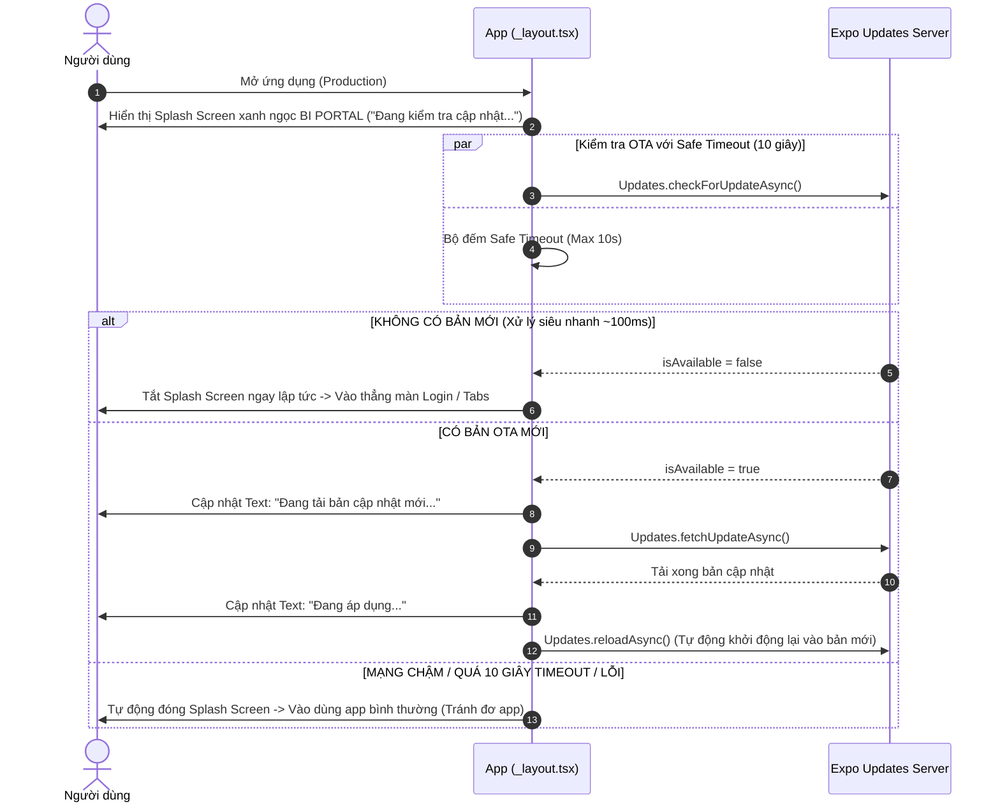

# Tài liệu Quy trình & Luồng xử lý OTA Update (OTA Update Flow)

Tài liệu này tổng hợp luồng xử lý chính về kiểm tra, tải xuống và áp dụng bản cập nhật OTA (Over-The-Air) trong ứng dụng **BI Portal** (React Native / Expo).

---

## Luồng Kiểm tra & Áp dụng OTA Update (Splash Screen OTA Flow)

### Quy trình hoạt động

### Các file liên quan
* [`src/app/_layout.tsx`](file:///d:/django_apps/rest/fontendapp/src/app/_layout.tsx#L19-L138): Chứa màn hình Splash thương hiệu và hàm `check_and_apply_update()` xử lý bất đồng bộ kết hợp `Promise.race` (Timeout 10s).
