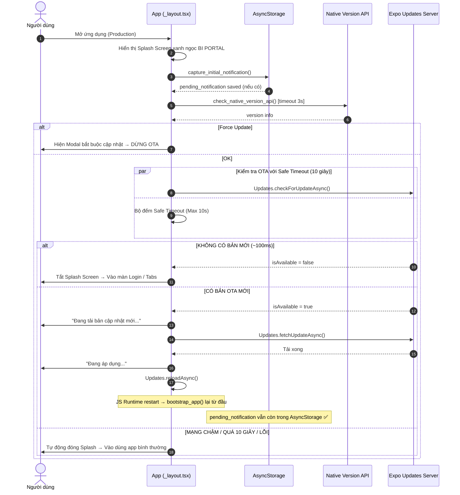

# Tài liệu Quy trình & Luồng xử lý OTA Update (OTA Update Flow)

Tài liệu này tổng hợp luồng xử lý chính về kiểm tra, tải xuống và áp dụng bản cập nhật OTA (Over-The-Air) trong ứng dụng **BI Portal** (React Native / Expo).

---

## Thứ tự ưu tiên thực thi khi Cold Boot (Bootstrap Sequence)

> **Quan trọng:** Thứ tự này không được thay đổi.

```
bootstrap_app()  ← được gọi trong useEffect của _layout.tsx
    │
    ├─► 1. capture_initial_notification()   ← PHẢI CHẠY ĐẦU TIÊN
    │         Lưu notification intent vào AsyncStorage TRƯỚC khi OTA có thể reload
    │         Đảm bảo deep-link không bị mất nếu reloadAsync() restart JS runtime
    │
    └─► 2. check_and_apply_update(true)     ← OTA + Native Version Check
              ├─ check_native_version_api()  (timeout 3s)
              └─ OTA check (timeout 10s)
```

---

## Luồng Kiểm tra & Áp dụng OTA Update (Splash Screen OTA Flow)

### Quy trình hoạt động



---

## Vì sao capture_initial_notification() phải chạy TRƯỚC OTA

```
LUỒNG CŨ (bug):
  Tap notification (Killed State)
      ↓
  OTA → reloadAsync()
      ↓
  JS Runtime restart → native response MẤT
      ↓
  index.tsx: getLastNotificationResponseAsync() → null
      ↓
  ❌ Không deep-link được

LUỒNG MỚI (đã fix):
  Tap notification (Killed State)
      ↓
  capture_initial_notification() → AsyncStorage (PERSISTENT)
      ↓
  OTA → reloadAsync()
      ↓
  JS Runtime restart → AsyncStorage VẪN CÒN
      ↓
  FeedbackContext hydrate (initialized = true)
      ↓
  index.tsx: get_pending_notification() → report_stt
      ↓
  ✅ router.replace('/report/{stt}') + clear pending
```

---

## AppState Active — OTA Background Check

```
App từ Background → Foreground (AppState 'active')
  └─► check_and_apply_update(false)   ← KHÔNG capture notification lại
        ├─ Mutex lock is_running ngăn race condition
        ├─ check_native_version_api()
        └─ OTA check (timeout 10s)

Lý do KHÔNG capture notification khi background resume:
  → Killed State đã được xử lý bởi bootstrap_app()
  → App alive tap notification xử lý qua NotificationContext listener
```

---

## Các file liên quan

| File | Vai trò |
|---|---|
| [`src/app/_layout.tsx`](../src/app/_layout.tsx) | `bootstrap_app()`, `capture_initial_notification()`, `check_and_apply_update()` |
| [`src/app/index.tsx`](../src/app/index.tsx) | Chờ `initialized`, đọc `pending_notification`, routing |
| [`src/context/FeedbackContext.tsx`](../src/context/FeedbackContext.tsx) | `initialized` flag, hydrate cache |
| [`src/storage/notification.ts`](../src/storage/notification.ts) | `PendingNotification`, `save/get/remove_pending_notification()` |
