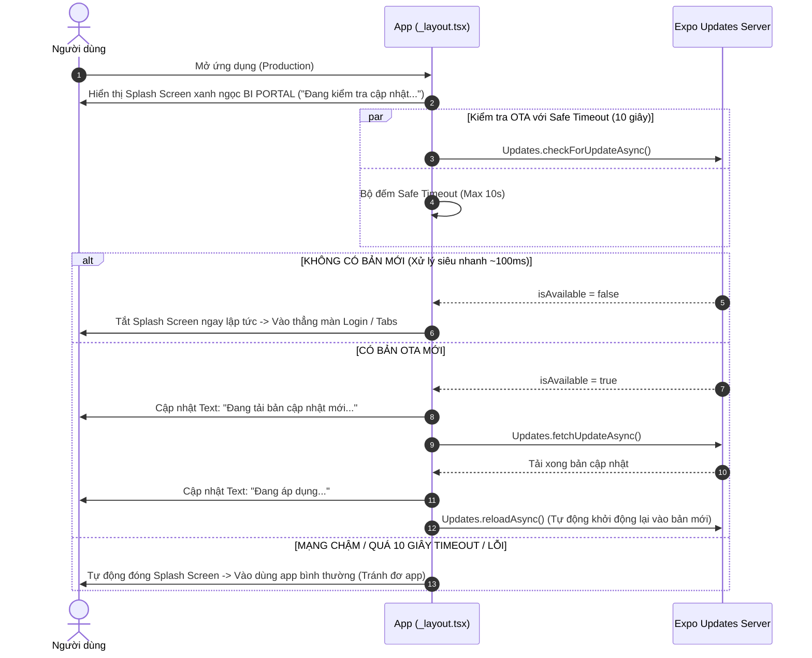
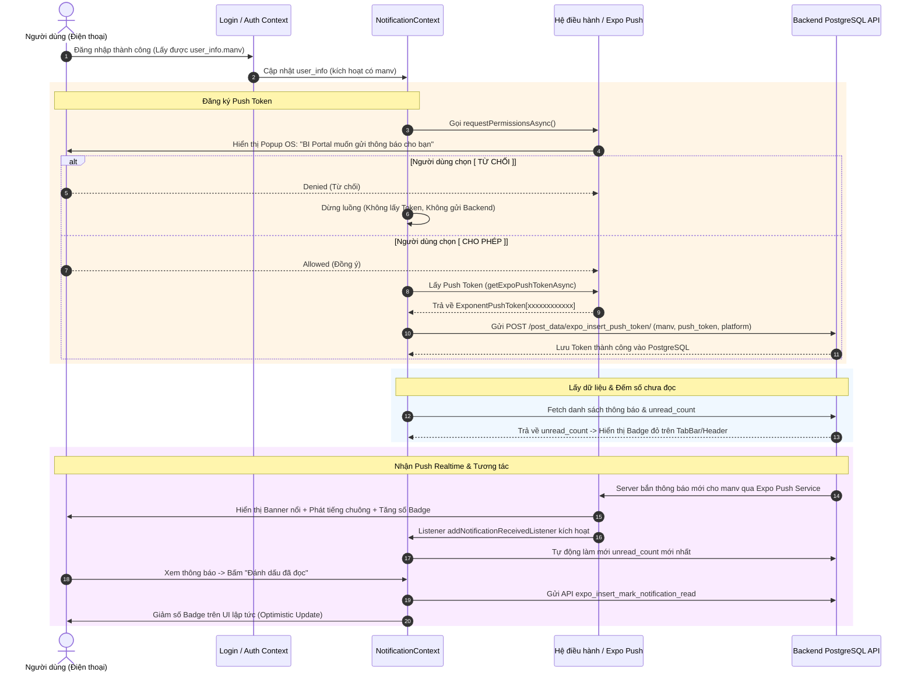
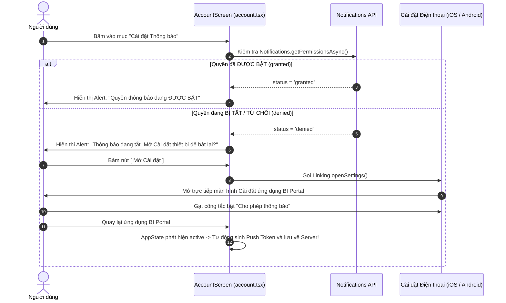

# Tài liệu Quy trình & Luồng xử lý Hệ thống (System Flow Documentation)

Tài liệu này tổng hợp toàn bộ các luồng xử lý chính đã được nâng cấp và triển khai trong ứng dụng **BI Portal** (React Native / Expo), bao gồm: Luồng kiểm tra OTA Update, Luồng Đăng nhập tối ưu, Luồng Thông báo Push Realtime và Luồng Khôi phục quyền Thông báo.

---

## 1. Luồng Kiểm tra & Áp dụng OTA Update (Splash Screen OTA Flow)

### Quy trình hoạt động

### Các file liên quan
* [`src/app/_layout.tsx`](file:///d:/django_apps/rest/fontendapp/src/app/_layout.tsx#L19-L138): Chứa màn hình Splash thương hiệu và hàm `check_and_apply_update()` xử lý bất đồng bộ kết hợp `Promise.race` (Timeout 10s).

---

## 2. Luồng Đăng nhập Tối ưu (Login Flow)

### Quy trình hoạt động
1. **Tự động ngầm gán Mã tổ chức**: Mã tổ chức mặc định `tenant_id = 'merap'` được gán ngầm dưới nền. Ô nhập "Mã tổ chức" được ẩn khỏi giao diện để tối giản trải nghiệm.
2. **Tự động Focus con trỏ**: Ngay khi mở màn hình Đăng nhập, con trỏ tự động nhấp nháy vào ô **Tên đăng nhập** (bật sẵn bàn phím), người dùng gõ tài khoản ngay không cần bấm thêm thao tác.
3. **Gửi yêu cầu**: Gửi payload `{ email: email.toUpperCase(), password, tenant_id: 'merap' }` về server backend PostgreSQL.

### Các file liên quan
* [`src/app/login.tsx`](file:///d:/django_apps/rest/fontendapp/src/app/login.tsx#L53-L140): Đặt `useState('merap')`, ẩn container input `Mã tổ chức` và dùng `useEffect` tự động `email_input_ref.current?.focus()`.

---

## 3. Luồng Quản lý Thông báo Push Realtime (Push Notification Flow)

### Quy trình hoạt động

### Các file liên quan
* [`src/context/NotificationContext.tsx`](file:///d:/django_apps/rest/fontendapp/src/context/NotificationContext.tsx#L112-L170): Chứa hàm `register_push_token_async`, cấu hình Android Notification Channel, lắng nghe `addNotificationReceivedListener` và xử lý API đếm chưa đọc (`unread_count`).
* [`src/app/_layout.tsx`](file:///d:/django_apps/rest/fontendapp/src/app/_layout.tsx#L10-L17): Cấu hình `Notifications.setNotificationHandler` hiển thị banner, âm thanh và badge khi app đang mở (Foreground).

---

## 4. Luồng Khôi phục quyền Thông báo trong Cài đặt (Notification Settings Recovery)

### Quy trình hoạt động

### Các file liên quan
* [`src/app/account.tsx`](file:///d:/django_apps/rest/fontendapp/src/app/account.tsx#L23-L47): Định nghĩa hàm `handle_notification_settings()` và nút bấm **"Cài đặt Thông báo"** tích hợp `Linking.openSettings()`.

---

## Tóm tắt các Endpoint API liên quan

| Endpoint Backend | Phương thức | Chức năng |
| :--- | :--- | :--- |
| `/get_data/expo_get_notifications/?manv={manv}` | `GET` | Lấy danh sách thông báo của nhân viên |
| `/get_data/expo_get_unread_notifications_count/?manv={manv}` | `GET` | Lấy số lượng thông báo chưa đọc |
| `/post_data/expo_insert_push_token/` | `POST` | Lưu cặp `(manv, push_token, platform)` vào PostgreSQL |
| `/post_data/expo_insert_mark_notification_read/` | `POST` | Đánh dấu 1 thông báo là đã đọc |
| `/post_data/expo_insert_mark_all_notifications_read/` | `POST` | Đánh dấu tất cả thông báo của nhân viên là đã đọc |
