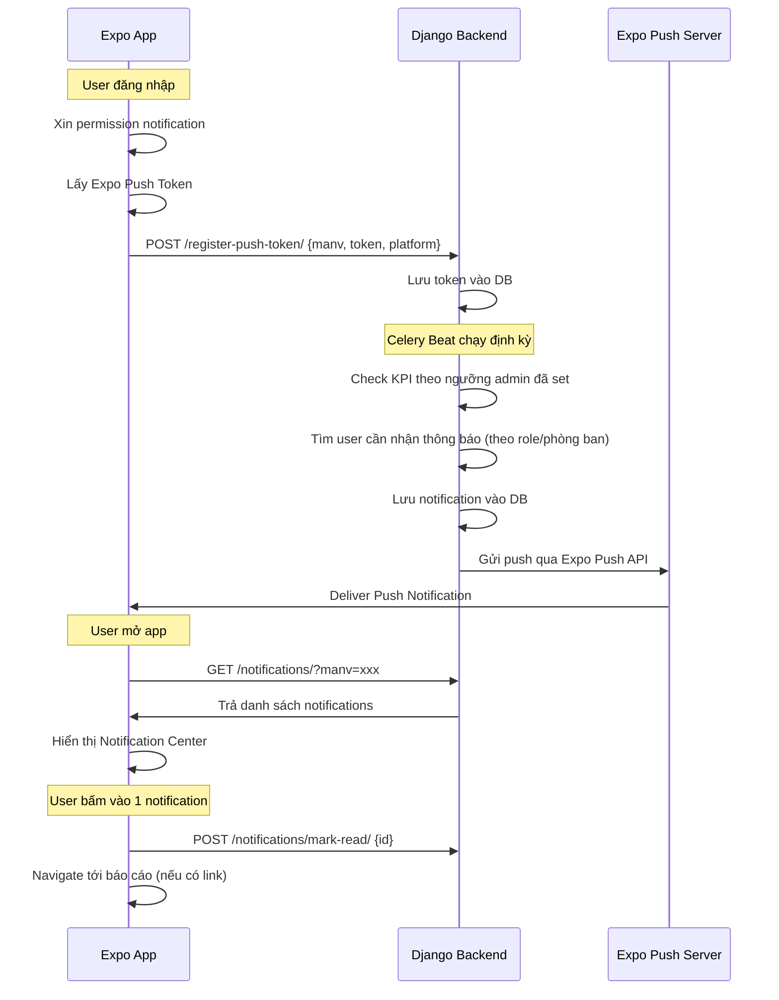

# 🔔 Push Notification KPI cho BIRA App

Thêm tính năng gửi Push Notification khi KPI thay đổi (rớt ngưỡng, tới hạn, đạt target, đột biến). Backend Django gửi qua Expo Push API, Frontend Expo nhận và hiển thị.

## User Review Required

> [!IMPORTANT]
> **Backend API URL**: Các endpoint mới sẽ được tạo dưới `https://bi.meraplion.com/local/` (cùng domain với `LOCALURL` hiện tại). Xác nhận đây là đúng nơi bạn muốn đặt API?

> [!WARNING]
> **Tab bar thay đổi**: Hiện có 3 tabs (Home, BIRA, Apps). Sẽ thêm tab thứ 4 "Thông báo". Điều này sẽ thay đổi layout tab bar hiện tại.

## Open Questions

> [!IMPORTANT]
> 1. **Backend Django project path**: Đường dẫn tới project Django backend để tạo API mới là gì? (ví dụ: `D:\django_apps\rest\...`)
> 2. **Badge count trên icon app**: Bạn có muốn hiện số thông báo chưa đọc trên icon app (app badge) không?

---

## Proposed Changes

### Tổng quan Flow



---

### Component 1: Backend Django — API Endpoints

> [!NOTE]
> Cần user cung cấp path tới Django project. Dưới đây là spec API để implement.

#### [NEW] API: Register Push Token
```
POST /local/push-token/register/
Body: { "manv": "MR1234", "expo_push_token": "ExponentPushToken[xxx]", "platform": "android" }
Response: { "status": "ok" }
```
- Lưu/update token theo `manv` + `platform` (1 user có thể nhiều device)
- Khi user logout → gọi API xóa token

#### [NEW] API: Notification List
```
GET /local/notifications/?manv=MR1234&page=1&page_size=20
Response: {
  "results": [
    {
      "id": 1,
      "title": "⚠️ Doanh thu rớt ngưỡng",
      "body": "Doanh thu khu vực HCM đạt 72%, dưới ngưỡng 80%",
      "type": "kpi_drop",          // kpi_drop | deadline | target_reached | anomaly
      "is_read": false,
      "report_stt": "5",           // nullable — link tới report nếu có
      "created_at": "2026-07-09T10:00:00Z"
    }
  ],
  "unread_count": 3,
  "total": 45
}
```

#### [NEW] API: Mark Notification as Read
```
POST /local/notifications/mark-read/
Body: { "manv": "MR1234", "notification_ids": [1, 2, 3] }
Response: { "status": "ok" }
```

#### [NEW] API: Mark All as Read
```
POST /local/notifications/mark-all-read/
Body: { "manv": "MR1234" }
Response: { "status": "ok" }
```

#### [NEW] API: Unread Count (nhẹ, cho polling badge)
```
GET /local/notifications/unread-count/?manv=MR1234
Response: { "unread_count": 3 }
```

#### [NEW] API: Unregister Push Token (khi logout)
```
POST /local/push-token/unregister/
Body: { "manv": "MR1234", "expo_push_token": "ExponentPushToken[xxx]" }
Response: { "status": "ok" }
```

---

### Component 2: Frontend — Push Token Registration

#### [NEW] [src/utils/notifications.ts](file:///d:/django_apps/rest/fontendapp/src/utils/notifications.ts)

Module xử lý toàn bộ logic notification:
- `register_for_push_notifications()` — Xin permission + lấy Expo Push Token
- `send_push_token_to_backend(manv, token)` — Gửi token lên backend
- `unregister_push_token(manv, token)` — Xóa token khi logout
- `setup_notification_listeners()` — Lắng nghe notification foreground/background
- `handle_notification_response(response)` — Xử lý khi user tap notification → navigate

Dùng `expo-notifications` (đã cài sẵn v57.0.3), `expo-device`, `expo-constants`.

---

### Component 3: Frontend — Notification Context

#### [NEW] [src/context/NotificationContext.tsx](file:///d:/django_apps/rest/fontendapp/src/context/NotificationContext.tsx)

Context provider riêng cho notification (tách ra khỏi FeedbackContext để không phình to):

```typescript
interface NotificationContextValue {
  notifications: Notification[];
  unread_count: number;
  loading: boolean;
  fetch_notifications: (manv: string) => Promise<void>;
  mark_as_read: (ids: number[]) => Promise<void>;
  mark_all_read: (manv: string) => Promise<void>;
  refresh_unread_count: (manv: string) => Promise<void>;
}
```

- Polling `unread_count` mỗi 60 giây khi app foreground
- Fetch full list khi mở Notification Center

---

### Component 4: Frontend — Notification Tab & Screen

#### [NEW] [src/app/(tabs)/notifications.tsx](file:///d:/django_apps/rest/fontendapp/src/app/%28tabs%29/notifications.tsx)

Màn hình Notification Center (tab thứ 4):
- Header với title "Thông báo" + nút "Đánh dấu tất cả đã đọc"
- FlatList hiển thị danh sách notification
- Mỗi item hiển thị: icon theo type, title, body, thời gian, trạng thái đọc/chưa đọc
- Pull-to-refresh
- Bấm vào item → đánh dấu đã đọc + navigate tới report nếu có `report_stt`
- Empty state khi không có thông báo

**Design theo type:**

| Type | Icon | Color | Label |
|---|---|---|---|
| `kpi_drop` | `trending-down` | `colors.error` | KPI rớt ngưỡng |
| `deadline` | `time` | `colors.warning` | Sắp tới hạn |
| `target_reached` | `checkmark-circle` | `colors.success` | Đạt mục tiêu |
| `anomaly` | `alert-circle` | `colors.info` | Biến động |

---

### Component 5: Frontend — Tab Bar Update

#### [MODIFY] [_layout.tsx](file:///d:/django_apps/rest/fontendapp/src/app/%28tabs%29/_layout.tsx)

Thêm tab "Thông báo" vào tab bar:
- Icon: `notifications` (Ionicons)
- Hiển thị badge count (số thông báo chưa đọc) trên icon tab
- Vị trí: giữa BIRA và Apps → thứ tự: Home, BIRA, **Thông báo**, Apps

---

### Component 6: Frontend — Header Bell Icon

#### [MODIFY] [CustomHeader.tsx](file:///d:/django_apps/rest/fontendapp/src/components/CustomHeader.tsx)

Thêm icon 🔔 vào header:
- Hiển thị badge đỏ khi có thông báo chưa đọc
- Bấm vào → navigate tới tab Thông báo

#### [MODIFY] [index.tsx](file:///d:/django_apps/rest/fontendapp/src/app/%28tabs%29/index.tsx)

Thêm icon 🔔 vào header của Home screen (vì Home tự vẽ header riêng, không dùng CustomHeader)

---

### Component 7: Frontend — Root Layout & Login Integration

#### [MODIFY] [_layout.tsx](file:///d:/django_apps/rest/fontendapp/src/app/_layout.tsx)

- Wrap thêm `NotificationProvider`
- Setup notification listeners ở root level (lắng nghe notification khi app chạy)
- Handle notification response (deep link tới report)

#### [MODIFY] [FeedbackContext.tsx](file:///d:/django_apps/rest/fontendapp/src/context/FeedbackContext.tsx)

- Sau khi `login_user` thành công → gọi `register_for_push_notifications()` + gửi token lên backend
- Khi `logout_user` → gọi `unregister_push_token()` để backend ngưng gửi

---

### Component 8: Frontend — Storage cho Push Token

#### [NEW] [src/storage/notification.ts](file:///d:/django_apps/rest/fontendapp/src/storage/notification.ts)

Lưu Expo Push Token vào AsyncStorage để:
- Không cần xin permission lại mỗi lần mở app
- Dùng khi logout để gửi API xóa token

---

## Folder Structure sau khi hoàn thành

```text
src/
├── app/
│   ├── _layout.tsx                  ← MODIFY (wrap NotificationProvider)
│   ├── (tabs)/
│   │   ├── _layout.tsx              ← MODIFY (thêm tab Thông báo + badge)
│   │   ├── notifications.tsx        ← NEW (Notification Center screen)
│   │   └── ...
│   └── ...
├── components/
│   ├── CustomHeader.tsx             ← MODIFY (thêm bell icon)
│   └── ...
├── context/
│   ├── FeedbackContext.tsx           ← MODIFY (tích hợp push token register/unregister)
│   └── NotificationContext.tsx      ← NEW (notification state management)
├── storage/
│   ├── notification.ts              ← NEW (lưu push token)
│   └── ...
├── utils/
│   ├── notifications.ts             ← NEW (push notification logic)
│   └── ...
└── styles/
    └── global.ts                    ← Dùng lại, không cần sửa
```

---

## Verification Plan

### Automated Tests
- Kiểm tra TypeScript compile: `npx tsc --noEmit`
- Kiểm tra app build: `npx expo start`

### Manual Verification
1. **Push Token Flow**: Login → kiểm tra console log Expo Push Token → verify token gửi lên backend
2. **Notification Center**: Mở tab Thông báo → hiển thị danh sách đúng
3. **Badge Count**: Kiểm tra badge trên tab icon + bell icon trong header
4. **Tap Notification**: Bấm vào notification → navigate đúng report
5. **Mark Read**: Bấm vào notification → trạng thái chuyển thành "đã đọc"
6. **Logout**: Logout → verify token bị xóa trên backend
7. **Push Test**: Gửi test push từ backend → app nhận được notification khi foreground/background
